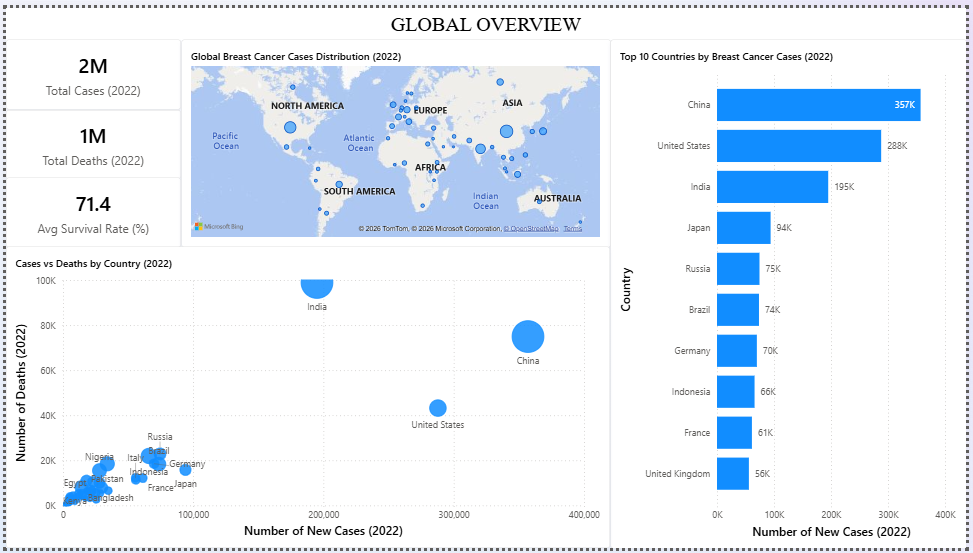
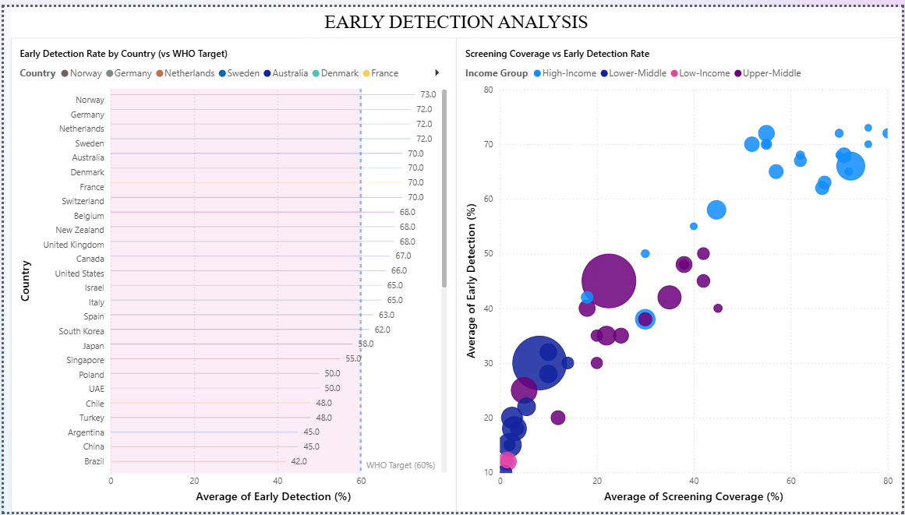
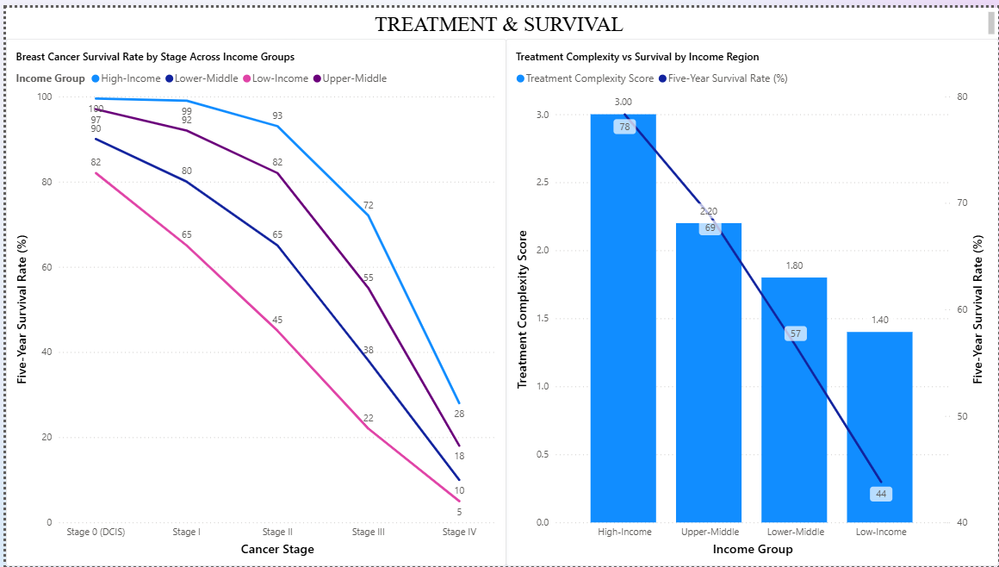
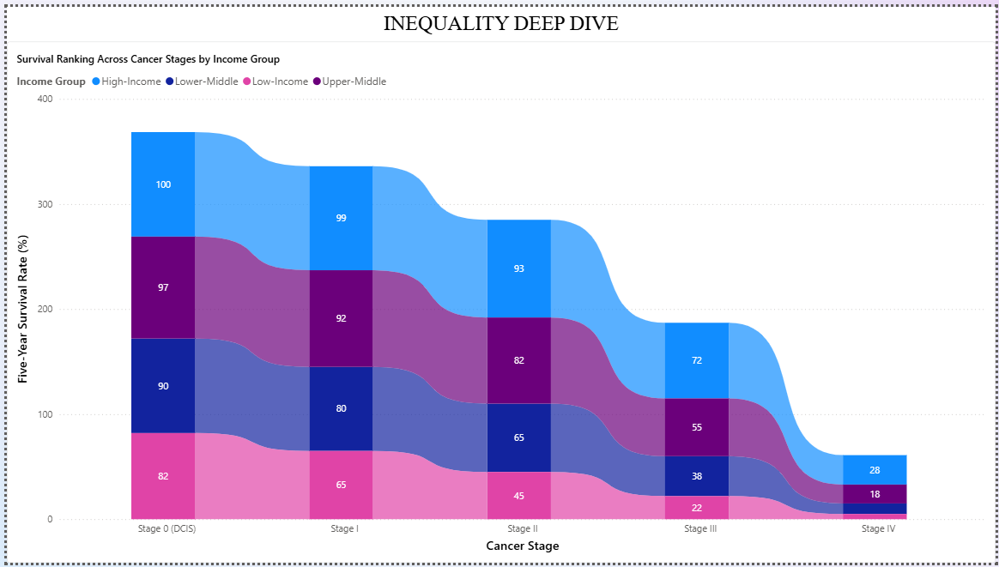
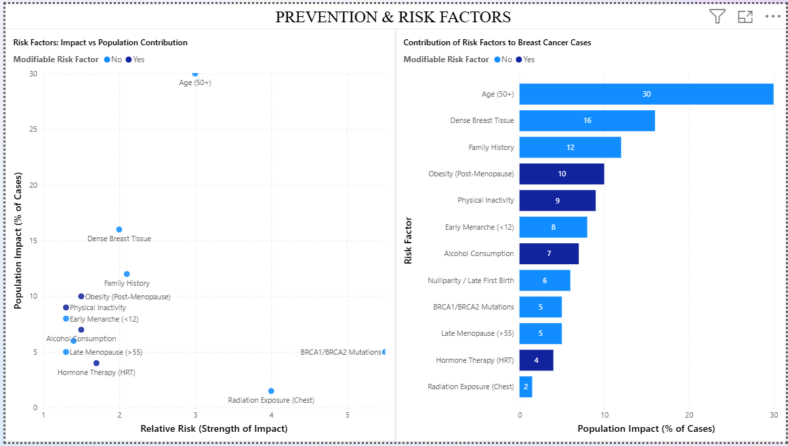

# 🌍 Global Breast Cancer Outcomes Analysis

## 📌 Overview
This project analyzes global breast cancer outcomes to understand how early detection, treatment access, and healthcare infrastructure influence survival rates across countries.

The goal is to identify key drivers of survival inequality and uncover actionable insights to improve healthcare outcomes globally.

---

## 🎯 Business Problem
Breast cancer outcomes vary significantly across countries, with lower-income regions experiencing later-stage diagnoses and poorer survival outcomes.

Healthcare stakeholders need to understand:
- How early detection impacts survival  
- The role of treatment access in advanced stages  
- Which risk factors contribute most to disease prevalence  

Without these insights, it becomes difficult to allocate resources effectively and design targeted interventions.

---

## 📊 Dashboard Preview

### 🌍 Global Overview

### 🔍 Early Detection Analysis

### 💉 Treatment & Survival

### 📉 Inequality Deep Dive

### ⚠️ Prevention & Risk Factors

---

## 🧠 Key Insights

- Survival declines significantly as cancer progresses across all income groups  
- High-income regions maintain near-perfect early-stage survival (~99.5%), while low-income regions start lower (~82%) and decline more sharply  
- By Stage IV, survival drops to ~28% in high-income regions and as low as ~5% in low-income regions, highlighting a widening inequality gap  
- Early detection strongly correlates with screening coverage, with high-income countries exceeding 65% detection while lower-income regions remain below 40%  
- Treatment access becomes a critical factor in later stages, significantly impacting survival outcomes  

---

## 🛠 Methodology

- Data cleaning and transformation using Power Query  
- Data modeling with relationships and bridge tables  
- Feature engineering (treatment complexity, detection groups)  
- Exploratory Data Analysis (EDA) across global datasets  
- Comparative analysis by income group  
- Stage-based survival analysis  
- Risk factor analysis (modifiable vs non-modifiable)  

---

## 📈 Business Recommendations

- Expand screening programs to improve early detection  
- Improve access to advanced treatments in lower-income regions  
- Prioritize late-stage treatment capacity where survival gaps are largest  
- Promote prevention strategies targeting lifestyle-related risk factors  
- Enable data-driven healthcare planning for better resource allocation  

---

## 🛠 Tools Used
- Power BI (data modeling, DAX, visualization)  
- Power Query (data cleaning and transformation)  
- Data Analysis (EDA, segmentation, correlation analysis)  

---

## 📊 Data Source
This project uses publicly available data from Kaggle for analytical and educational purposes.

- Source: [here](https://www.kaggle.com/datasets/zkskhurram/breast-cancer-stat-and-aware-dataset-2022-2025/data)

The dataset was cleaned, transformed, and modeled to support cross-country and stage-based analysis.

---

## 📁 Files Included
- Global Breast Cancer Analysis Report (PDF)  
- Power BI Dashboard (.pbix)  
- Dataset  

---

## 💡 Key Takeaway
Early detection improves outcomes, but access to advanced treatment determines survival in later stages — making healthcare inequality a critical global issue.

---

⭐️ *Turning data into insights that matter.*
